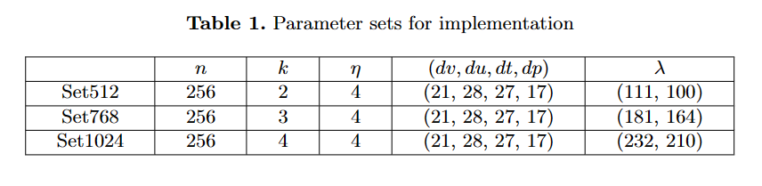

# L-CPABE：格属性加密算法实现

#### 介绍
本仓库实现了基于RLWE困难问题的属性加密系统。

#### 运行环境

| 库 | 版本号 |
|-----|-----|
| python | 3.9.7 |
| matplotlib | 3.8.0 |
| networkx | 2.6.3 |
| numpy | 1.24.4 |
| pycryptodome | 3.19.0 |

#### 使用说明

* params.py为加密解密中用到的参数
* ABE.py为初始化、密钥生成、加密、解密算法核心文件
* setup()函数生成属性密钥集合
* SKGen()函数根据用户属性生成用户私钥
* PKGen()函数生成属性密钥基于RLWE困难问题的公钥
* encrypt()/decrypt()分别为加密解密函数

#### 安全性说明

#### 参考文献
[1] X. Qian and W. Wu, An Efficient Ciphertext Policy Attribute-Based Encryption
Scheme from Lattices and Its Implementation, in IEEE ICCCS, 2021, pp. 732-742.

[2] S. Zhao, R. Jiang and B. Bhargava, RL-ABE: A Revocable Lattice Attribute
Based Encryption Scheme Based on R-LWE Problem in Cloud Storage, IEEE
Trans. Serv. Comput., vol. 15, no. 2, pp. 1026-1035, 1 March-April 2022, doi:
10.1109/TSC.2020.2973256.

[3] E. Chen, Y. Zhu, K. Liang and H. Yin, Secure Remote Cloud File Shar-
ing With Attribute-Based Access Control and Performance Optimization, IEEE
Trans. on Cloud Comput., vol. 11, no. 1, pp. 579-594, 1 Jan.-March 2023, doi:
10.1109/TCC.2021.3104323.